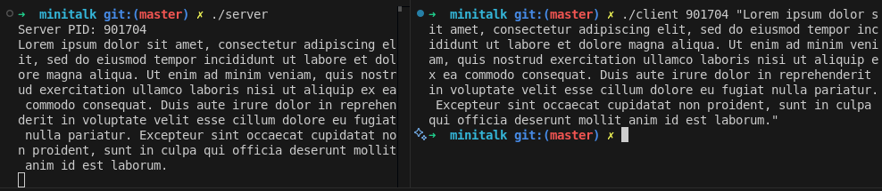

# minitalk
**minitalk** is a project from the 42 curriculum that consists of creating a simple client-server communication system using UNIX signals. The goal is to send messages from a client process to a server process, one bit at a time, using only `SIGUSR1` and `SIGUSR2` signals. The server reconstructs the message and displays it.

## How It Works

- The **server** starts and prints its PID. It waits for signals from clients.
- The **client** takes the server's PID and a message as arguments. It sends each character of the message, bit by bit, to the server using signals.
- Each bit is sent as a signal: `SIGUSR1` for bit 1, `SIGUSR2` for bit 0.
- The server reconstructs the characters from the received bits and prints the message.
- An acknowledgment mechanism is implemented: after each bit is received and processed, the server sends back a signal to the client to confirm reception, ensuring synchronization and data integrity.

## Implementation Details

- The project is written in C and uses only UNIX signals for inter-process communication.
- The code is organized into a `client` and a `server`, with shared utility functions and a custom library (`libft`).
- The server uses a signal handler to process incoming bits and reconstruct characters.
- The client waits for an acknowledgment from the server before sending the next bit, using a global variable to track acknowledgment.

## About the Signal Queue

During the development, I initially implemented a queue structure (`t_signal_queue`) in the server to buffer incoming signals. This was an early approach to ensure data integrity during message transmission, especially in case multiple signals arrived before being processed.

However, after introducing a global variable and an acknowledgment mechanism (where the client waits for the server's confirmation before sending the next bit), the queue became unnecessary. The acknowledgment ensures that signals are processed one at a time, preventing data loss or overlap.

Despite this, I decided to leave the queue code in the project as a trace of the initial design and as a demonstration of one way to handle potential signal overflow or race conditions.

## Usage

1. **Compile the project:**
```sh
make
```
2. **Start the server:**
```sh
./server
```
3. **Send a message from the client:**
```sh
./client <server_pid> "Your message"
```

## Notes
- Only standard UNIX signals are used for communication.
- The project demonstrates low-level inter-process communication and synchronization.
- The queue implementation in the server is not strictly necessary with the current acknowledgment mechanism but is left for educational purposes.

## Screenshot

